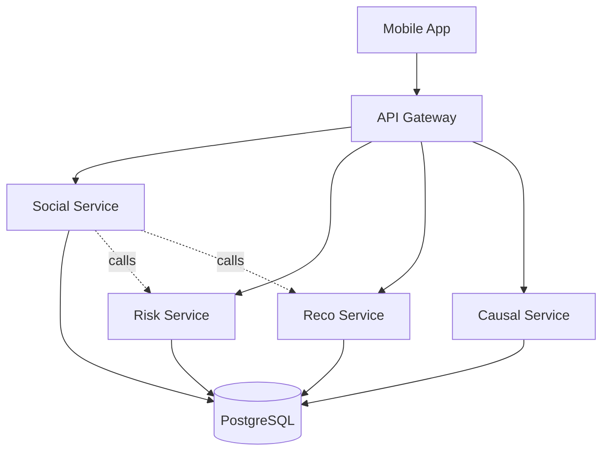

# Recoverly Platform - System Architecture

## Overview

The Recoverly Platform is a microservices-based system for recovery support, combining AI-powered risk detection, personalized interventions, peer support, and causal analysis.

## System Components



## Services

### 1. Social Service (Component 3)
**Owner:** Member 3  
**Port:** 8003  
**Schema:** `social`

**Responsibilities:**
- Analyze user messages with ML models
- Calculate risk scores and assign risk levels
- Trigger interventions using agentic AI
- Manage escalations, nudges, and meetings

**Key Features:**
- Multi-signal risk fusion (text + behavior + checkins)
- Temporal aggregation and trend detection
- Action layer with AI decision-making
- Transparency in recommendations

### 2. Risk Service (Component 1)
**Owner:** Member 1  
**Port:** 8001  
**Schema:** `risk`

**Responsibilities:**
- ML-based relapse risk prediction
- Feature extraction and preprocessing
- Temporal pattern analysis
- Explainable AI (SHAP/LIME)

### 3. Reco Service (Component 2)
**Owner:** Member 2  
**Port:** 8002  
**Schema:** `reco`

**Responsibilities:**
- Context-aware intervention recommendations
- Environment and activity suggestions
- Adaptive learning from user feedback
- Personalized recovery plans

### 4. Causal Service (Component 4)
**Owner:** Member 4  
**Port:** 8004  
**Schema:** `causal`

**Responsibilities:**
- Social media causal factor analysis
- Sentiment analysis
- Topic modeling and extraction
- Trigger identification and ranking

## Database Architecture

### Schema Organization

```
recoverly_platform (database)
├── core (schema)       # Shared tables
│   ├── users
│   └── messages
├── social (schema)     # Social service tables
│   ├── message_predictions
│   ├── user_risk_profiles
│   ├── actions
│   ├── nudges
│   ├── escalations
│   └── meetings
├── risk (schema)       # Risk service tables
├── reco (schema)       # Reco service tables
└── causal (schema)     # Causal service tables
```

### Shared Tables (core schema)

**`core.users`** - User profiles
- `user_id` (PK)
- `username`, `email`
- `created_at`, `last_active`

**`core.messages`** - All user messages
- `message_id` (PK)
- `user_id` (FK)
- `message_text`
- `timestamp`
- `conversation_type`

## Inter-Service Communication

### REST API Calls

Services communicate via HTTP REST APIs:

```python
# Example: Social service calls Risk service
async def get_risk_prediction(user_id: str):
    async with httpx.AsyncClient() as client:
        response = await client.get(
            f"http://risk-service:8001/api/predict/{user_id}"
        )
        return response.json()
```

### Future: Message Queue

For production, consider using RabbitMQ or Redis for:
- Async communication
- Event-driven architecture
- Better scalability

## Technology Stack

### Common
- **Language:** Python 3.10+
- **Web Framework:** FastAPI
- **Database:** PostgreSQL 16
- **ORM:** SQLAlchemy
- **Validation:** Pydantic

### Service-Specific
- **Social Service:** PyTorch, Transformers (DistilBERT)
- **Risk Service:** SHAP, LIME, scikit-learn
- **Reco Service:** Recommendation algorithms
- **Causal Service:** NLTK, spaCy, VADER

## Deployment

### Development
```bash
# Start all services
cd scripts
./run_dev.bat
```

### Docker
```bash
docker-compose up
```

### Production
- Kubernetes for orchestration
- Separate databases per service (optional)
- API Gateway (nginx)
- Load balancing

## Security

### Authentication
- JWT tokens (future)
- API keys for service-to-service
- Rate limiting

### Data Protection
- Encrypted connections (TLS)
- Sensitive data encryption at rest
- HIPAA compliance considerations

## Monitoring

### Health Checks
Each service exposes `/api/health` endpoint

### Logging
- Centralized logging
- Log levels: DEBUG, INFO, WARNING, ERROR
- Structured logs (JSON)

### Metrics
- Request latency
- Error rates
- Database query performance

## Scalability

### Horizontal Scaling
- Each service can scale independently
- Load balancer distributes requests
- Stateless services

### Database
- Connection pooling
- Read replicas for heavy queries
- Schema-based isolation

## Development Workflow

### Git Branching
```
main
├── feature/social-service
├── feature/risk-service
├── feature/reco-service
└── feature/causal-service
```

### Code Review
- Pull requests required
- At least one approval
- CI/CD checks must pass

### Testing
- Unit tests per service
- Integration tests
- End-to-end tests

## Future Enhancements

1. **API Gateway** - Single entry point with nginx
2. **Message Queue** - RabbitMQ for async communication
3. **Caching** - Redis for frequently accessed data
4. **Real-time Updates** - WebSockets for live notifications
5. **Mobile SDK** - Native libraries for iOS/Android
