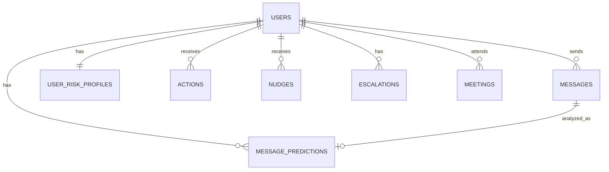

# Database Schema Documentation

## Overview

The Recoverly Platform uses a single PostgreSQL database (`recoverly_platform`) with multiple schemas for separation of concerns.

## Schema Organization

```
recoverly_platform
├── core        # Shared tables (all services)
├── social      # Social service tables
├── risk        # Risk service tables
├── reco        # Reco service tables
└── causal      # Causal service tables
```

---

## Core Schema (Shared)

### `core.users`
User profiles shared across all services.

| Column | Type | Constraints | Description |
|--------|------|-------------|-------------|
| user_id | VARCHAR(255) | PRIMARY KEY | Unique user identifier |
| username | VARCHAR(100) | UNIQUE | Username |
| email | VARCHAR(255) | UNIQUE | Email address |
| full_name | VARCHAR(255) | | Full name |
| phone | VARCHAR(50) | | Phone number |
| created_at | TIMESTAMP | DEFAULT NOW() | Account creation time |
| last_active | TIMESTAMP | | Last activity timestamp |
| status | VARCHAR(50) | DEFAULT 'active' | Account status |
| metadata | JSONB | | Additional user data |

### `core.messages`
All user messages across conversations.

| Column | Type | Constraints | Description |
|--------|------|-------------|-------------|
| message_id | SERIAL | PRIMARY KEY | Auto-incrementing ID |
| user_id | VARCHAR(255) | FK → core.users | Message author |
| message_text | TEXT | NOT NULL | Message content |
| timestamp | TIMESTAMP | DEFAULT NOW() | When message was sent |
| conversation_type | VARCHAR(50) | | 'buddy', 'counselor', 'group' |
| recipient_id | VARCHAR(255) | | Message recipient |
| metadata | JSONB | | Additional message data |

**Indexes:**
- `idx_messages_user_time` ON (user_id, timestamp DESC)
- `idx_messages_timestamp` ON (timestamp DESC)
- `idx_messages_conversation` ON (conversation_type)

---

## Social Schema (Component 3)

### `social.message_predictions`
ML model predictions for each message.

| Column | Type | Constraints | Description |
|--------|------|-------------|-------------|
| id | SERIAL | PRIMARY KEY | Prediction ID |
| message_id | INTEGER | FK → core.messages | Related message |
| user_id | VARCHAR(255) | FK → core.users | User |
| timestamp | TIMESTAMP | DEFAULT NOW() | Prediction time |
| p_craving | REAL | | Craving probability |
| p_relapse | REAL | | Relapse probability |
| p_negative_mood | REAL | | Negative mood probability |
| p_neutral | REAL | | Neutral probability |
| p_toxic | REAL | | Toxic content probability |
| p_isolation | REAL | | Isolation probability |
| risk_score | REAL | | Overall risk score |
| conversation_type | VARCHAR(50) | | Conversation type |
| model_version | VARCHAR(50) | | ML model version |

### `social.user_risk_profiles`
Aggregated risk profiles per user.

| Column | Type | Constraints | Description |
|--------|------|-------------|-------------|
| user_id | VARCHAR(255) | PRIMARY KEY, FK | User identifier |
| last_updated | TIMESTAMP | DEFAULT NOW() | Last update time |
| short_avg_risk_score | REAL | | 7-day average risk |
| short_max_risk_score | REAL | | 7-day max risk |
| short_avg_isolation | REAL | | 7-day average isolation |
| short_high_risk_count | INTEGER | | High-risk messages (7d) |
| short_toxic_incidents | INTEGER | | Toxic messages (7d) |
| medium_avg_risk_score | REAL | | 30-day average risk |
| medium_max_risk_score | REAL | | 30-day max risk |
| medium_avg_isolation | REAL | | 30-day average isolation |
| risk_trend | VARCHAR(50) | | 'improving', 'stable', 'declining' |
| isolation_trend | VARCHAR(50) | | Isolation trend |
| current_risk_label | VARCHAR(50) | | Current risk level |
| risk_label_since | TIMESTAMP | | When label was assigned |
| total_messages_7d | INTEGER | | Message count (7d) |
| buddy_messages_7d | INTEGER | | Buddy messages (7d) |
| counselor_messages_7d | INTEGER | | Counselor messages (7d) |
| last_message_time | TIMESTAMP | | Last message timestamp |
| days_since_last_buddy_msg | INTEGER | | Days since buddy contact |
| reasons | JSONB | | Reasons for risk label |

### `social.actions`
Actions triggered by the system.

| Column | Type | Constraints | Description |
|--------|------|-------------|-------------|
| action_id | SERIAL | PRIMARY KEY | Action ID |
| user_id | VARCHAR(255) | FK → core.users | Target user |
| timestamp | TIMESTAMP | DEFAULT NOW() | Action time |
| action_type | VARCHAR(100) | | Type of action |
| risk_level | VARCHAR(50) | | Risk level at trigger |
| action_data | JSONB | | Action details |
| status | VARCHAR(50) | DEFAULT 'pending' | Action status |
| outcome | VARCHAR(50) | | Action outcome |
| ai_reasoning | TEXT | | AI decision explanation |
| confidence_score | REAL | | AI confidence |

### `social.nudges`
Nudges sent to users.

| Column | Type | Constraints | Description |
|--------|------|-------------|-------------|
| nudge_id | SERIAL | PRIMARY KEY | Nudge ID |
| user_id | VARCHAR(255) | FK → core.users | Target user |
| timestamp | TIMESTAMP | DEFAULT NOW() | Creation time |
| nudge_type | VARCHAR(100) | | Nudge category |
| nudge_message | TEXT | NOT NULL | Nudge content |
| risk_level | VARCHAR(50) | | Risk level |
| sent_at | TIMESTAMP | | When sent |
| viewed_at | TIMESTAMP | | When viewed |
| acted_on_at | TIMESTAMP | | When acted upon |
| user_response | VARCHAR(50) | | User response |
| response_data | JSONB | | Response details |

### `social.escalations`
Escalations to counselors/family.

| Column | Type | Constraints | Description |
|--------|------|-------------|-------------|
| escalation_id | SERIAL | PRIMARY KEY | Escalation ID |
| user_id | VARCHAR(255) | FK → core.users | User |
| timestamp | TIMESTAMP | DEFAULT NOW() | Escalation time |
| escalation_type | VARCHAR(100) | | Type of escalation |
| urgency | VARCHAR(50) | | Urgency level |
| risk_score | REAL | | Risk score at time |
| risk_level | VARCHAR(50) | | Risk level |
| trigger_reason | TEXT | | Why escalated |
| trigger_data | JSONB | | Additional context |
| escalated_to | VARCHAR(255) | | Recipient ID |
| notification_method | VARCHAR(50) | | How notified |
| status | VARCHAR(50) | DEFAULT 'pending' | Escalation status |
| acknowledged_at | TIMESTAMP | | When acknowledged |
| resolved_at | TIMESTAMP | | When resolved |
| resolution_notes | TEXT | | Resolution details |

### `social.meetings`
Scheduled meetings.

| Column | Type | Constraints | Description |
|--------|------|-------------|-------------|
| meeting_id | SERIAL | PRIMARY KEY | Meeting ID |
| user_id | VARCHAR(255) | FK → core.users | User |
| created_at | TIMESTAMP | DEFAULT NOW() | Creation time |
| meeting_type | VARCHAR(100) | | Type of meeting |
| scheduled_time | TIMESTAMP | | When scheduled |
| duration_minutes | INTEGER | | Duration |
| counselor_id | VARCHAR(255) | | Counselor ID |
| participants | JSONB | | Participant IDs |
| user_consent | BOOLEAN | DEFAULT FALSE | User consent |
| consent_given_at | TIMESTAMP | | Consent timestamp |
| status | VARCHAR(50) | DEFAULT 'scheduled' | Meeting status |
| completed_at | TIMESTAMP | | Completion time |
| notes | TEXT | | Meeting notes |

---

## Risk Schema (Component 1)

*To be defined by Member 1*

Suggested tables:
- `risk.feature_snapshots` - Extracted features
- `risk.model_predictions` - ML predictions
- `risk.xai_explanations` - SHAP/LIME explanations

---

## Reco Schema (Component 2)

*To be defined by Member 2*

Suggested tables:
- `reco.recommendations` - Generated recommendations
- `reco.feedback` - User feedback
- `reco.context_snapshots` - Context data

---

## Causal Schema (Component 4)

*To be defined by Member 4*

Suggested tables:
- `causal.posts` - Social media posts
- `causal.extracted_causes` - Identified causes
- `causal.sentiments` - Sentiment analysis results
- `causal.rankings` - Ranked causal factors

---

## Relationships



---

## Indexes Summary

### Core Schema
- Users: `user_id` (PK), `username` (UNIQUE), `email` (UNIQUE)
- Messages: `message_id` (PK), `(user_id, timestamp)`, `timestamp`, `conversation_type`

### Social Schema
- All tables indexed on `user_id` and `timestamp`
- Risk profiles indexed on `current_risk_label`
- Actions indexed on `action_type` and `status`
- Escalations indexed on `urgency` and `status`

---

## Data Retention

- Messages: Keep indefinitely (anonymize after 2 years)
- Predictions: Keep for 1 year
- Actions/Nudges: Keep for 6 months
- Escalations: Keep for 2 years (compliance)

---

## Backup Strategy

- Daily full backups
- Hourly incremental backups
- 30-day retention
- Off-site storage
